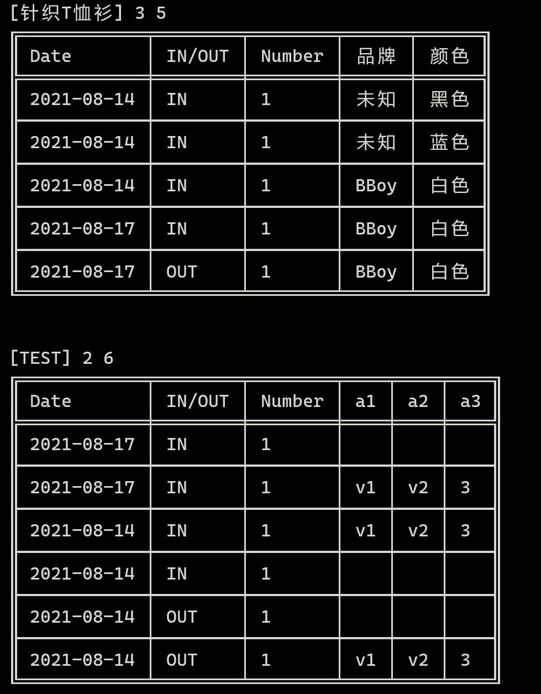

<!-- README模板：https://github.com/xixi36500/Best-README-Template/blob/support-chinese/Chinese/BLANK_README.md -->

[![Contributors][contributors-shield]][contributors-url]
[![Forks][forks-shield]][forks-url]
[![Stargazers][stars-shield]][stars-url]
[![Issues][issues-shield]][issues-url]
[![MIT License][license-shield]][license-url]
[![LinkedIn][linkedin-shield]][linkedin-url]


<!-- PROJECT LOGO -->
<br />
<p align="center">
  <a href="https://github.com/w158rk/PWMS">
    
  </a>

  <h3 align="center">PWMS</h3>

  <p align="center">
    个人使用的仓库管理系统
    <br />
    <a href="https://github.com/w158rk/PWMS"><strong>浏览文档 »</strong></a>
    <br />
    <br />
    <a href="https://github.com/w158rk/PWMS">查看演示</a>
    ·
    <a href="https://github.com/w158rk/PWMS/issues">报告Bug</a>
    ·
    <a href="https://github.com/w158rk/PWMS/issues">请求功能</a>
  </p>
</p>


<!-- TABLE OF CONTENTS -->
<details open="open">
  <summary><h2 style="display: inline-block">目录</h2></summary>
  <ol>
    <li>
      <a href="#about-the-project">关于项目</a>
      <ul>
        <li><a href="#built-with">构建</a></li>
      </ul>
    </li>
    <li>
      <a href="#getting-started">入门</a>
      <ul>
        <li><a href="#prerequisites">先决条件</a></li>
        <li><a href="#installation">安装</a></li>
      </ul>
    </li>
    <li><a href="#usage">使用</a></li>
    <li><a href="#roadmap">路线图</a></li>
    <li><a href="#contributing">贡献</a></li>
    <li><a href="#license">许可证</a></li>
    <li><a href="#contact">联系人</a></li>
    <li><a href="#acknowledgements">致谢</a></li>
  </ol>
</details>


<!-- ABOUT THE PROJECT -->
## 关于项目

个人仓库管理系统，或个人物品管理系统，管理你凌乱的生活

如下文件内容

```
category 针织T恤衫 181105 品牌 颜色.
category TEST 002 a1 a2 a3.
2021-08-14 IN 针织T恤衫 1 件 未知 黑色.
IN 针织T恤衫 1 件 海澜之家 蓝色.
IN 针织T恤衫 1 件 BBoy 白色.
2021-08-17 IN 针织T恤衫 1 件 BBoy 白色.
OUT 针织T恤衫 1 件 BBoy 白色.
备注.

IN TEST 1 UNIT.
IN TEST 1 UNIT v1 v2 3.
2021-08-14 IN TEST 1 UNIT v1 v2 3.
2021-08-14 IN TEST 1 UNIT.
OUT TEST 1 UNIT.
OUT TEST 1 UNIT v1 v2 3.
```

生成结果如下

```
[针织T恤衫] 3 5
╔════════════╤════════╤════════╤══════╤══════╗
║ Date       │ IN/OUT │ Number │ 品牌 │ 颜色 ║
╠════════════╪════════╪════════╪══════╪══════╣
║ 2021-08-14 │ IN     │ 1      │ 未知 │ 黑色 ║
╟────────────┼────────┼────────┼──────┼──────╢
║ 2021-08-14 │ IN     │ 1      │ 未知 │ 蓝色 ║
╟────────────┼────────┼────────┼──────┼──────╢
║ 2021-08-14 │ IN     │ 1      │ BBoy │ 白色 ║
╟────────────┼────────┼────────┼──────┼──────╢
║ 2021-08-17 │ IN     │ 1      │ BBoy │ 白色 ║
╟────────────┼────────┼────────┼──────┼──────╢
║ 2021-08-17 │ OUT    │ 1      │ BBoy │ 白色 ║
╚════════════╧════════╧════════╧══════╧══════╝


[TEST] 2 6
╔════════════╤════════╤════════╤════╤════╤════╗
║ Date       │ IN/OUT │ Number │ a1 │ a2 │ a3 ║
╠════════════╪════════╪════════╪════╪════╪════╣
║ 2021-08-17 │ IN     │ 1      │    │    │    ║
╟────────────┼────────┼────────┼────┼────┼────╢
║ 2021-08-17 │ IN     │ 1      │ v1 │ v2 │ 3  ║
╟────────────┼────────┼────────┼────┼────┼────╢
║ 2021-08-14 │ IN     │ 1      │ v1 │ v2 │ 3  ║
╟────────────┼────────┼────────┼────┼────┼────╢
║ 2021-08-14 │ IN     │ 1      │    │    │    ║
╟────────────┼────────┼────────┼────┼────┼────╢
║ 2021-08-14 │ OUT    │ 1      │    │    │    ║
╟────────────┼────────┼────────┼────┼────┼────╢
║ 2021-08-14 │ OUT    │ 1      │ v1 │ v2 │ 3  ║
╚════════════╧════════╧════════╧════╧════╧════╝
```

使用等宽中文字体效果会比较好：如下:arrow_down:

<a href="https://github.com/w158rk/PWMS">

</a>


### 构建

```bash
gradle build
```

<!-- GETTING STARTED -->
## 入门


### 先决条件

- 安装JDK和[gradle](https://gradle.org/)

### 安装

1. 克隆仓库

```bash
git clone https://github.com/w158rk/PWMS.git
```

2. 运行测试

```bash
gradle test
```

3. 构建

```bash
gradle build
```

构建完成后，解压`app\build\distributions\app.zip`，在`app/bin`目录下的`app`脚本为可执行脚本

<!-- USAGE EXAMPLES -->
## 使用

```bash
./app <path-to-your-file>
```

<!-- ROADMAP -->
## 路线图

### 当前版本：v0.0.1

#### 已实现功能

- ~~编译入库出库文件~~
- ~~终端输出仓库描述~~
- bug: 4位编号与YEAR冲突

<!-- CONTRIBUTING -->
## 贡献

贡献使开源社区成为一个值得学习、启发和创造的地方。 **非常感谢**你所做的任何贡献。

1. Fork 项目
2. 创建功能分支 (`git checkout -b feature/AmazingFeature`)
3. 提交更改 (`git commit -m 'Add some AmazingFeature'`)
4. Push 到分支 (`git push origin feature/AmazingFeature`)
5. 打开 Pull 请求


<!-- LICENSE -->
## 许可证

根据麻省理工学院的许可证(`MIT`)  分发. 查看 `LICENSE` 获取更多信息。


<!-- CONTACT -->
## 联系人

Ruikai Wang - wrk15835@outlook.com

项目链接: [https://github.com/w158rk/PWMS](https://github.com/w158rk/PWMS)


<!-- ACKNOWLEDGEMENTS -->
## 致谢


<!-- MARKDOWN LINKS & IMAGES -->
<!-- https://www.markdownguide.org/basic-syntax/#reference-style-links -->
[contributors-shield]: https://img.shields.io/github/contributors/w158rk/PWMS.svg?style=for-the-badge
[contributors-url]: https://github.com/w158rk/PWMS/graphs/contributors
[forks-shield]: https://img.shields.io/github/forks/w158rk/PWMS.svg?style=for-the-badge
[forks-url]: https://github.com/w158rk/PWMS/network/members
[stars-shield]: https://img.shields.io/github/stars/w158rk/PWMS.svg?style=for-the-badge
[stars-url]: https://github.com/w158rk/PWMS/stargazers
[issues-shield]: https://img.shields.io/github/issues/w158rk/PWMS.svg?style=for-the-badge
[issues-url]: https://github.com/w158rk/PWMS/issues
[license-shield]: https://img.shields.io/github/license/w158rk/PWMS.svg?style=for-the-badge
[license-url]: https://github.com/w158rk/PWMS/blob/master/LICENSE.txt
[linkedin-shield]: https://img.shields.io/badge/-LinkedIn-black.svg?style=for-the-badge&logo=linkedin&colorB=555
[linkedin-url]: https://linkedin.com/in/w158rk