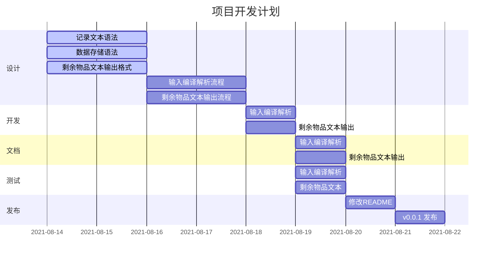

# 开发时间计划

```mermaid
gantt
    dateFormat  YYYY-MM-DD
    title       项目开发计划

    section 设计
    %% Completed task            :done,       des1, 2014-01-06,2014-01-08
    记录文本语法                    :active,    syntax, 2021-08-14, 2d
    数据存储语法                    :active,    ds, 2021-08-14, 2d
    剩余物品文本输出格式              :active,    textout, 2021-08-14, 2d
    输入编译解析流程                :            proc-compile, after syntax, 2d
    剩余物品文本输出流程             :           proc-textout, after textout, 2d

    section 开发
    输入编译解析                :         dev-compile, after proc-compile, 1d
    剩余物品文本输出             :         dev-textout, after proc-textout, 1d

    section 文档
    输入编译解析             :         doc-compile, after dev-compile, 1d
    剩余物品文本输出          :         doc-textout, after dev-textout, 1d

    section 测试
    输入编译解析             :         test-compile, after dev-compile, 1d
    剩余物品文本             :         test-textout, after dev-textout, 1d

    section 发布
    修改README          :   readme, after test-compile, 1d
    v0.0.1 发布         :   v0.0.1, after readme, 1d

```